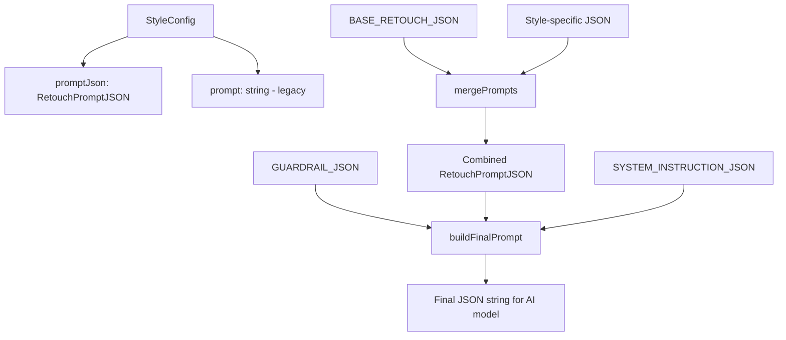

# Design Document: JSON Prompt Migration

## Overview

This design migrates the existing text-based prompts in `constants.ts` to a structured JSON format optimized for image generation models. The migration covers:
- 5 retouch styles (Sculpted Glow, Dark Skin Glow, Gilded Editorial, Ultra Glam, Soft Beauty)
- SOURCE_ADHERENCE_GUARDRAIL
- BASE_RETOUCH template
- SYSTEM_INSTRUCTION

The JSON format provides explicit structure for task type, retouching steps, intensity values, target areas, and global style settings.

## Architecture



## Components and Interfaces

### Core JSON Schema Types

```typescript
// Retouching step definition
interface RetouchingStep {
  step_name: string;
  target_area: string;
  operation: string;
  intensity?: number;  // 0.0 - 1.0
  value?: string;
  details: string;
}

// Output settings
interface OutputSettings {
  aspect_ratio: 'maintain_original' | string;
  resolution: 'maintain_original' | string;
  format: 'jpeg' | 'png' | 'webp';
  comparison: boolean;
}

// Global style configuration
interface GlobalStyle {
  aesthetic_goal: string;
  prohibitions: string;
  final_check: string;
}

// Main prompt JSON structure
interface RetouchPromptJSON {
  task_type: 'image_retouching';
  input_image_id: string;
  style_profile: string;
  output_settings: OutputSettings;
  retouching_steps: RetouchingStep[];
  global_style: GlobalStyle;
  metadata: {
    original_label: string;
    description: string;
  };
}

// Guardrail JSON structure
interface GuardrailJSON {
  protocol: string;
  mandatory_requirements: string[];
  absolute_prohibitions: string[];
  allowed_modifications: string[];
  identity_rule: string;
}

// System instruction JSON structure
interface SystemInstructionJSON {
  role: string;
  absolute_rule: string;
  source_adherence: string[];
  goal: string;
  critical_rules: string[];
  absolute_restrictions: string[];
  retouching_process: RetouchingStep[];
  final_check: string[];
}
```

### Updated StyleConfig Interface

```typescript
interface StyleConfig {
  id: EnhanceStyle;
  label: string;
  description: string;
  prompt: string;           // Legacy text prompt (kept for backward compatibility)
  promptJson: RetouchPromptJSON;  // New JSON prompt
  thumbnail: string;
  recommended?: boolean;
}
```

### Utility Functions

```typescript
// Merge base retouch JSON with style-specific JSON
function mergeRetouchPrompts(
  base: RetouchPromptJSON, 
  style: Partial<RetouchPromptJSON>
): RetouchPromptJSON;

// Convert JSON prompt to formatted string for AI model
function formatPromptForModel(prompt: RetouchPromptJSON): string;

// Build final prompt with guardrails and system instruction
function buildFinalPrompt(
  stylePrompt: RetouchPromptJSON,
  guardrail: GuardrailJSON,
  systemInstruction: SystemInstructionJSON
): string;
```

## Data Models

### BASE_RETOUCH_JSON Structure

```typescript
const BASE_RETOUCH_JSON: Partial<RetouchPromptJSON> = {
  task_type: 'image_retouching',
  output_settings: {
    aspect_ratio: 'maintain_original',
    resolution: 'maintain_original',
    format: 'jpeg',
    comparison: false
  },
  retouching_steps: [
    {
      step_name: 'Precise-Segmentation',
      target_area: 'face_skin, neck, ears, hands, arms, shoulders, legs, eye_sclera, teeth',
      operation: 'detect_and_mask',
      details: 'Detect and mask skin areas. EXCLUDE: hair, nails, clothing, background, lips shape, mouth shape'
    },
    {
      step_name: 'Skin-Tone-Evening',
      target_area: 'all_skin_regions',
      operation: 'tone_evening',
      intensity: 0.30,
      details: 'Even skin tone. Per-region: Face (0.25-0.35), Neck (0.20-0.30), Hands (0.15-0.25), Body (0.10-0.20). Preserve shadows/highlights.'
    },
    // ... 7 more steps
  ],
  global_style: {
    aesthetic_goal: 'Natural, premium retouching for fashion, editorial, portrait photography',
    prohibitions: 'NO global blur, NO plastic smoothing, NO altering facial/body structure, NO artificial texture, NO cropping/resizing, NO adding teeth',
    final_check: 'Skin textured at 100% zoom, no halos, no color mismatches, identity preserved'
  }
};
```

### Example Style JSON (Ultra Glam)

```typescript
const ULTRA_GLAM_JSON: RetouchPromptJSON = {
  task_type: 'image_retouching',
  input_image_id: 'user_input_image',
  style_profile: 'Ultra Glam (Maximum Intensity)',
  output_settings: {
    aspect_ratio: 'maintain_original',
    resolution: 'maintain_original',
    format: 'jpeg',
    comparison: false
  },
  retouching_steps: [
    {
      step_name: 'Extreme-Skin-Perfection',
      target_area: 'face, neck, body (all visible skin)',
      operation: 'aggressive_smooth_texture',
      intensity: 0.95,
      details: 'HEAVY frequency separation smoothing. Remove 100% of pores, blemishes, texture. Skin must look airbrushed, porcelain-smooth. CRITICAL: Preserve natural skin tone/color.'
    },
    {
      step_name: 'Extreme-Wet-Look-Highlights',
      target_area: 'center_forehead, nose_bridge, cheekbone_tops, cupids_bow, chin_center, collar_bones',
      operation: 'intense_dodge_highlight',
      value: 'EXTREME bright highlights',
      details: 'Create sharp, intense, highly reflective, wet-look highlights. Nose bridge highlight MAXIMUM intensity.'
    },
    // ... more steps
  ],
  global_style: {
    aesthetic_goal: 'HYPER-RETOUCHED, HIGH-CONTRAST, ULTRA-GLAMOROUS, high-fashion editorial',
    prohibitions: 'NEVER change pose, facial/body structure, proportions, background. NEVER add eye effects.',
    final_check: 'Verify: Impossibly smooth skin, Intense reflections, Deep contours, Brilliant white eyes. Retouching must be OBVIOUS and DRAMATIC.'
  },
  metadata: {
    original_label: 'Ultra Glam',
    description: 'Maximum intensity. Extreme luminance, ultra-deep contouring, glass-like skin perfection.'
  }
};
```


## Correctness Properties

*A property is a characteristic or behavior that should hold true across all valid executions of a system-essentially, a formal statement about what the system should do. Properties serve as the bridge between human-readable specifications and machine-verifiable correctness guarantees.*

### Property 1: JSON Serialization Round Trip
*For any* valid RetouchPromptJSON object, serializing it with JSON.stringify and then deserializing with JSON.parse should produce an object that is deeply equal to the original.
**Validates: Requirements 1.2**

### Property 2: Schema Validation Completeness
*For any* JSON object passed to the schema validator, the validator should return true if and only if the object contains all required fields (task_type, style_profile, retouching_steps, global_style) with correct types.
**Validates: Requirements 1.3**

### Property 3: Guardrail Round Trip
*For any* valid GuardrailJSON object, serializing and deserializing should produce an equivalent object.
**Validates: Requirements 3.3**

### Property 4: Base Retouch Round Trip
*For any* valid base retouch JSON object, serializing and deserializing should produce an equivalent object.
**Validates: Requirements 4.3**

### Property 5: System Instruction Round Trip
*For any* valid SystemInstructionJSON object, serializing and deserializing should produce an equivalent object.
**Validates: Requirements 5.3**

### Property 6: Merge Preserves Base Steps
*For any* base RetouchPromptJSON and style-specific RetouchPromptJSON, merging them should produce a result that contains all retouching_steps from the base.
**Validates: Requirements 4.2, 8.1**

### Property 7: Merge Produces Valid JSON
*For any* two valid RetouchPromptJSON objects (base and style), the merged result should be a valid RetouchPromptJSON that can be serialized to valid JSON.
**Validates: Requirements 8.2**

### Property 8: Style Override Precedence
*For any* base and style JSON with overlapping step names, the merged result should contain the style-specific values for those steps while preserving non-overlapping base steps.
**Validates: Requirements 8.4**

### Property 9: Format Output is Valid JSON
*For any* valid RetouchPromptJSON, the formatPromptForModel function should produce a string that is valid JSON (parseable without errors).
**Validates: Requirements 1.4**

## Error Handling

| Error Condition | Handling Strategy |
|-----------------|-------------------|
| Invalid JSON structure | Throw `InvalidPromptSchemaError` with details of missing/invalid fields |
| Missing required fields | Return validation result with list of missing fields |
| Invalid intensity value (outside 0-1) | Clamp to valid range and log warning |
| Merge conflict (incompatible types) | Style-specific value takes precedence, log warning |
| Legacy prompt without JSON equivalent | Fall back to text prompt, log deprecation warning |

## Testing Strategy

### Property-Based Testing

The project will use **fast-check** for property-based testing in TypeScript.

Each property-based test will:
- Run a minimum of 100 iterations
- Be tagged with the format: `**Feature: json-prompt-migration, Property {number}: {property_text}**`
- Generate random valid JSON structures using custom arbitraries

### Unit Tests

Unit tests will cover:
- Each style's JSON structure contains expected step names
- Guardrail JSON contains all original prohibitions
- Base retouch JSON has exactly 9 steps
- System instruction JSON has all required sections
- Specific intensity values for Ultra Glam (>= 0.90)

### Test File Structure

```
constants.test.ts          # Existing test file - add JSON prompt tests
types.test.ts              # New - type validation tests
services/promptService.test.ts  # New - merge and format function tests
```
