# Design Document: Retouch Features

## Overview

This design document covers three key features for the Retouch Software application:

1. **Background Replacement Guardrail** - Ensures logo overlays are preserved during background replacement operations
2. **Application Tour Logic** - Controls tour display to maximum 3 times with persistent tracking
3. **Image History Persistence** - Dual storage system using local storage for offline access and Supabase for cross-device sync

## Architecture

```mermaid
flowchart TD
    subgraph "Background Replacement Flow"
        A[User selects background] --> B[Store logo overlay state]
        B --> C[Execute background replacement]
        C --> D[Restore logo overlay]
        D --> E[Composite final image]
    end

    subgraph "Tour Logic Flow"
        F[User login/register] --> G{Check tour count}
        G -->|count < 3| H[Show tour]
        G -->|count >= 3| I[Skip tour]
        H --> J[Increment count]
        J --> K[Store count]
    end

    subgraph "History Storage Flow"
        L[Retouch completes] --> M[Generate thumbnail]
        M --> N[Save to localStorage]
        N --> O{User logged in?}
        O -->|Yes| P[Upload to Supabase]
        O -->|No| Q[Local only]
    end
```



## Components and Interfaces

### 1. Logo Overlay Guardrail

The logo overlay is a separate DOM element positioned absolutely over the processed image. During background replacement, we must capture and restore its state.

```typescript
interface LogoOverlayState {
  position: { x: number; y: number };
  size: { width: number; height: number };
  visible: boolean;
  zIndex: number;
}

// In Editor.tsx - capture before background replacement
const captureLogoState = (): LogoOverlayState | null => {
  const logoElement = document.querySelector('[data-logo-overlay]');
  if (!logoElement) return null;
  
  const rect = logoElement.getBoundingClientRect();
  const style = window.getComputedStyle(logoElement);
  
  return {
    position: { x: rect.left, y: rect.top },
    size: { width: rect.width, height: rect.height },
    visible: style.visibility !== 'hidden' && style.display !== 'none',
    zIndex: parseInt(style.zIndex) || 100
  };
};

// Restore after background replacement
const restoreLogoState = (state: LogoOverlayState) => {
  const logoElement = document.querySelector('[data-logo-overlay]');
  if (!logoElement || !state) return;
  
  // Logo is CSS-positioned, so we just ensure it's visible
  // The logo element maintains its position relative to the container
  (logoElement as HTMLElement).style.visibility = state.visible ? 'visible' : 'hidden';
  (logoElement as HTMLElement).style.zIndex = String(state.zIndex);
};
```

### 2. Tour Display Logic

Update the existing tutorial logic to use a more robust tracking system.

```typescript
// constants.ts - Tour configuration
export const TOUR_CONFIG = {
  MAX_DISPLAY_COUNT: 3,
  STORAGE_KEY: 'skinRetoucher_tourShownCount',
  DISABLED_KEY: 'skinRetoucher_tutorialDisabled'
};

// Tour management functions
export const getTourDisplayCount = (): number => {
  const count = localStorage.getItem(TOUR_CONFIG.STORAGE_KEY);
  return count ? parseInt(count, 10) : 0;
};

export const incrementTourCount = (): number => {
  const newCount = getTourDisplayCount() + 1;
  localStorage.setItem(TOUR_CONFIG.STORAGE_KEY, String(newCount));
  return newCount;
};

export const shouldShowTour = (): boolean => {
  const disabled = localStorage.getItem(TOUR_CONFIG.DISABLED_KEY) === 'true';
  if (disabled) return false;
  return getTourDisplayCount() < TOUR_CONFIG.MAX_DISPLAY_COUNT;
};

export const resetTourCount = (): void => {
  localStorage.setItem(TOUR_CONFIG.STORAGE_KEY, '0');
  localStorage.removeItem(TOUR_CONFIG.DISABLED_KEY);
};

export const disableTourPermanently = (): void => {
  localStorage.setItem(TOUR_CONFIG.DISABLED_KEY, 'true');
};
```

### 3. Local History Storage

```typescript
// types.ts - Extended history types
export interface LocalHistoryItem {
  id: string;
  thumbnail: string; // Compressed base64 thumbnail
  originalId?: string; // Reference to full image if stored
  processedId?: string;
  style: EnhanceStyle;
  timestamp: number;
  lastEditState: 'original' | 'processed' | 'background_changed';
  isRemote: boolean; // Indicates if synced to Supabase
  remoteId?: string; // Supabase record ID
}

// services/localHistoryService.ts
export class LocalHistoryService {
  private readonly STORAGE_KEY = 'skinRetoucher_history';
  private readonly MAX_ITEMS = 50;
  private readonly THUMBNAIL_SIZE = 200; // px

  generateThumbnail(imageBase64: string): Promise<string> {
    return new Promise((resolve) => {
      const img = new Image();
      img.onload = () => {
        const canvas = document.createElement('canvas');
        const scale = Math.min(
          this.THUMBNAIL_SIZE / img.width,
          this.THUMBNAIL_SIZE / img.height
        );
        canvas.width = img.width * scale;
        canvas.height = img.height * scale;
        
        const ctx = canvas.getContext('2d')!;
        ctx.drawImage(img, 0, 0, canvas.width, canvas.height);
        resolve(canvas.toDataURL('image/jpeg', 0.7));
      };
      img.src = imageBase64;
    });
  }

  async saveItem(item: Omit<LocalHistoryItem, 'thumbnail'>, processedImage: string): Promise<LocalHistoryItem> {
    const thumbnail = await this.generateThumbnail(processedImage);
    const historyItem: LocalHistoryItem = { ...item, thumbnail };
    
    const items = this.getItems();
    items.unshift(historyItem);
    
    // Limit storage size
    const trimmed = items.slice(0, this.MAX_ITEMS);
    localStorage.setItem(this.STORAGE_KEY, JSON.stringify(trimmed));
    
    return historyItem;
  }

  getItems(): LocalHistoryItem[] {
    const data = localStorage.getItem(this.STORAGE_KEY);
    return data ? JSON.parse(data) : [];
  }

  deleteItem(id: string): void {
    const items = this.getItems().filter(item => item.id !== id);
    localStorage.setItem(this.STORAGE_KEY, JSON.stringify(items));
  }

  updateItem(id: string, updates: Partial<LocalHistoryItem>): void {
    const items = this.getItems().map(item => 
      item.id === id ? { ...item, ...updates } : item
    );
    localStorage.setItem(this.STORAGE_KEY, JSON.stringify(items));
  }

  clearAll(): void {
    localStorage.removeItem(this.STORAGE_KEY);
  }
}

export const localHistoryService = new LocalHistoryService();
```

### 4. Supabase History Sync

Extend the existing supabaseService with sync capabilities:

```typescript
// services/supabaseService.ts - Additional methods

async syncHistoryOnLogin(userId: string): Promise<void> {
  // Fetch remote history
  const remoteItems = await this.getRetouchHistoryWithImages(userId);
  
  // Get local items
  const localItems = localHistoryService.getItems();
  
  // Merge: add remote items not in local
  for (const remote of remoteItems) {
    const existsLocally = localItems.some(
      local => local.remoteId === remote.id
    );
    
    if (!existsLocally && remote.processed_image_url) {
      // Add to local with remote reference
      await localHistoryService.saveItem({
        id: `local_${remote.id}`,
        style: remote.style as EnhanceStyle,
        timestamp: new Date(remote.created_at).getTime(),
        lastEditState: 'processed',
        isRemote: true,
        remoteId: remote.id
      }, remote.processed_image_url);
    }
  }
}

async deleteHistoryWithCascade(
  id: string, 
  originalUrl?: string, 
  processedUrl?: string
): Promise<void> {
  // Delete files from storage
  const deletePromises: Promise<void>[] = [];
  
  if (originalUrl) {
    deletePromises.push(this.deleteRetouchImage(originalUrl));
  }
  if (processedUrl) {
    deletePromises.push(this.deleteRetouchImage(processedUrl));
  }
  
  await Promise.all(deletePromises);
  
  // Delete database record
  const { error } = await this.supabase
    .from('retouch_history')
    .delete()
    .eq('id', id);
  
  if (error) throw error;
}
```

## Data Models

### Local Storage Schema

```typescript
// localStorage keys
{
  "skinRetoucher_history": LocalHistoryItem[],
  "skinRetoucher_tourShownCount": string, // number as string
  "skinRetoucher_tutorialDisabled": "true" | undefined
}
```

### Supabase Schema (existing, no changes needed)

The existing `retouch_history` table already supports:
- `id`, `user_id`, `style`, `resolution`, `credits_used`
- `original_image_url`, `processed_image_url`
- `created_at`

## Correctness Properties

*A property is a characteristic or behavior that should hold true across all valid executions of a system-essentially, a formal statement about what the system should do. Properties serve as the bridge between human-readable specifications and machine-verifiable correctness guarantees.*

### Property 1: Logo overlay preservation during background replacement
*For any* background replacement operation with an existing logo overlay, the logo overlay's position, size, and visibility SHALL remain unchanged after the operation completes.
**Validates: Requirements 1.1, 1.2, 1.3**

### Property 2: Logo overlay compositing order
*For any* completed background replacement operation, the logo overlay SHALL be rendered on top of (higher z-index than) the processed image.
**Validates: Requirements 1.4**

### Property 3: Tour display threshold
*For any* tour display count value, the tour SHALL display if and only if the count is less than 3 and the tour is not permanently disabled.
**Validates: Requirements 2.2, 2.4**

### Property 4: Tour count increment
*For any* tour display event, the tour display count SHALL increase by exactly 1.
**Validates: Requirements 2.3**

### Property 5: Local storage persistence round-trip
*For any* history item saved to local storage, retrieving items from local storage SHALL return an item with matching id, style, timestamp, and a valid thumbnail.
**Validates: Requirements 3.1, 3.2, 3.3**

### Property 6: Local history deletion
*For any* local history item that is deleted, subsequent retrieval of history items SHALL not include the deleted item.
**Validates: Requirements 3.4**

### Property 7: Remote history cascading delete
*For any* remote history item deletion, both the database record AND all associated storage files SHALL be removed.
**Validates: Requirements 4.3, 4.4, 5.3**

### Property 8: History display update after deletion
*For any* delete operation (local or remote), the displayed history list SHALL not contain the deleted item after the operation completes.
**Validates: Requirements 5.4**

## Error Handling

### Background Replacement Guardrail
- If logo element is not found, proceed with background replacement without guardrail
- If logo state capture fails, log warning and continue
- If logo restoration fails, log error but don't fail the operation

### Tour Logic
- If localStorage is unavailable, default to showing tour (graceful degradation)
- If count parsing fails, reset to 0

### History Storage
- If localStorage quota exceeded, remove oldest items and retry
- If Supabase upload fails, keep local copy and mark for retry
- If sync fails on login, continue with local-only mode
- If cascading delete partially fails, log error and report to user

## Testing Strategy

### Property-Based Testing

Use `fast-check` library for property-based tests:

1. **Logo preservation property**: Generate random logo states, simulate background replacement, verify state unchanged
2. **Tour threshold property**: Generate random count values (0-10), verify correct show/hide behavior
3. **Local storage round-trip**: Generate random history items, save and retrieve, verify equality
4. **Cascading delete**: Generate history items with files, delete, verify all removed

### Unit Tests

1. `captureLogoState()` returns correct structure
2. `restoreLogoState()` applies state correctly
3. `shouldShowTour()` returns correct boolean for edge cases (0, 2, 3, 4)
4. `incrementTourCount()` increments by exactly 1
5. `localHistoryService.saveItem()` stores item correctly
6. `localHistoryService.deleteItem()` removes item
7. `deleteHistoryWithCascade()` calls both storage and database delete

### Integration Tests

1. Full background replacement flow with logo overlay
2. Tour display across multiple sessions
3. History sync on login
4. Delete flow for both local and remote items
