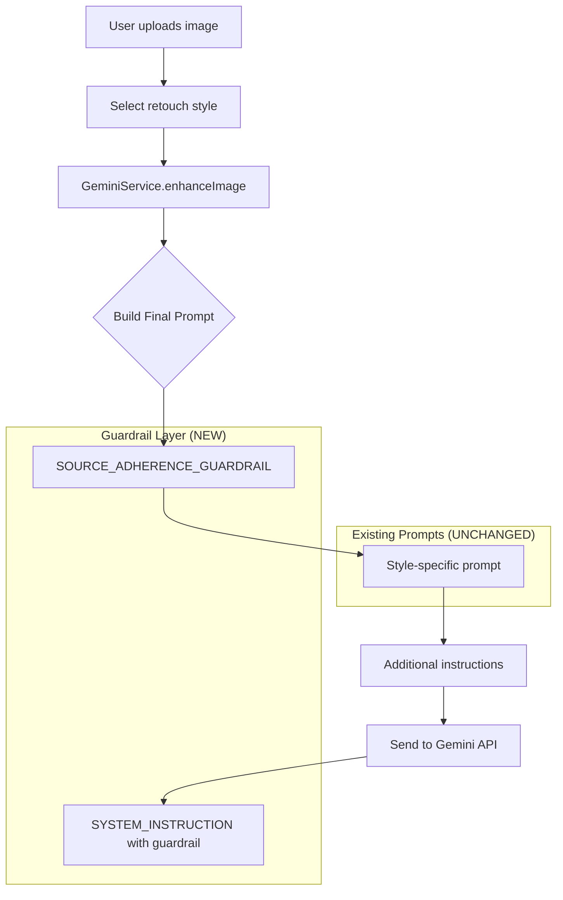

# Design Document: Source Image Adherence Guardrail

## Overview

This feature adds a source adherence guardrail layer to the existing image retouching system. The guardrail consists of explicit instructions that are prepended to all prompts and added to the system instruction, ensuring the AI treats every operation as retouching (not generation) and strictly adheres to the provided source image.

The existing style prompts (`BASE_RETOUCH`, individual style prompts) work correctly and will remain unchanged. The guardrail acts as an additional protective layer.

## Architecture



## Components and Interfaces

### 1. New Constant: SOURCE_ADHERENCE_GUARDRAIL

A new constant in `constants.ts` that contains the source adherence instructions:

```typescript
export const SOURCE_ADHERENCE_GUARDRAIL = `
**CRITICAL: SOURCE IMAGE ADHERENCE PROTOCOL**

This is a RETOUCH operation, NOT image generation. You MUST work with the PROVIDED SOURCE IMAGE.

MANDATORY REQUIREMENTS:
1. The output MUST be a retouched version of the INPUT image - NOT a new creation
2. PRESERVE exactly: subject identity, pose, position, facial features, expression, body shape
3. PRESERVE exactly: background, scene composition, framing, all non-skin elements
4. You are a NON-GENERATIVE photo editor - enhance what exists, create nothing new

ABSOLUTE PROHIBITIONS:
- DO NOT generate a new person or replace the subject
- DO NOT create a new scene or change the background
- DO NOT alter the subject's identity, face shape, or distinguishing features
- DO NOT change pose, position, or body proportions
- DO NOT imagine or invent any elements not present in the source

ALLOWED MODIFICATIONS (visual characteristics only):
- Skin smoothing, blemish removal, tone evening
- Lighting adjustments, color grading, contrast
- Texture enhancement, dodge & burn
- Eye whitening, teeth whitening (if visible)

The person in your output MUST be recognizably the SAME person from the input image.
`;
```

### 2. Updated SYSTEM_INSTRUCTION

Modify the existing `SYSTEM_INSTRUCTION` to include source adherence as the top priority:

```typescript
export const SYSTEM_INSTRUCTION = `
**CRITICAL: YOU ARE A PHOTO RETOUCHER, NOT AN IMAGE GENERATOR**

Your ONLY task is to RETOUCH the provided source image. You must NEVER generate a new image or replace the subject.

ABSOLUTE RULE: The output must show the EXACT SAME PERSON from the input, with the EXACT SAME pose, position, and background. Only apply visual enhancements.

[... existing SYSTEM_INSTRUCTION content ...]
`;
```

### 3. GeminiService Modifications

Update `enhanceImage()` method to prepend the guardrail:

```typescript
async enhanceImage(
  imageBase64: string,
  style: EnhanceStyle,
  customPrompt?: string,
  resolution: '1K' | '2K' | '4K' = '4K'
): Promise<string> {
  // ... existing code ...
  
  let promptText = "";

  // ALWAYS start with source adherence guardrail
  promptText = SOURCE_ADHERENCE_GUARDRAIL + "\n\n";

  if (style === EnhanceStyle.Custom && customPrompt) {
    promptText += `Retouch this image based on the following instruction: ${customPrompt}. ...`;
  } else {
    const selectedStyle = STYLES.find(s => s.id === style);
    promptText += selectedStyle ? selectedStyle.prompt : STYLES[0].prompt;
    
    if (customPrompt) {
      promptText += ` \nAdditional Instruction: ${customPrompt}`;
    }
  }
  
  // ... rest of existing code ...
}
```

### 4. reEnhanceImage Modifications

Update `reEnhanceImage()` to include the guardrail:

```typescript
async reEnhanceImage(
  imageBase64: string,
  resolution: '1K' | '2K' | '4K' = '4K'
): Promise<string> {
  const reEnhancePrompt = SOURCE_ADHERENCE_GUARDRAIL + `\n\n` +
    `INTENSIVE RE-ENHANCEMENT: This image needs additional retouching...`;
  
  return this.enhanceImage(imageBase64, EnhanceStyle.Natural, reEnhancePrompt, resolution);
}
```

## Data Models

No new data models required. The feature only adds string constants and modifies prompt construction.

## Correctness Properties

*A property is a characteristic or behavior that should hold true across all valid executions of a system-essentially, a formal statement about what the system should do. Properties serve as the bridge between human-readable specifications and machine-verifiable correctness guarantees.*

Based on the prework analysis, the following properties can be verified through testing:

### Property 1: Guardrail inclusion in all style prompts
*For any* retouch style selected, the final prompt sent to the API SHALL include the SOURCE_ADHERENCE_GUARDRAIL text.
**Validates: Requirements 1.1, 2.1**

### Property 2: Guardrail inclusion for custom prompts
*For any* custom prompt provided by the user, the final prompt SHALL wrap the custom instruction with the SOURCE_ADHERENCE_GUARDRAIL.
**Validates: Requirements 1.1, 2.2**

### Property 3: Guardrail inclusion in re-enhance operations
*For any* re-enhance operation, the prompt SHALL include the SOURCE_ADHERENCE_GUARDRAIL text.
**Validates: Requirements 2.3**

### Property 4: System instruction contains source adherence directives
*For any* API call, the SYSTEM_INSTRUCTION SHALL contain explicit source adherence directives prohibiting image generation.
**Validates: Requirements 2.4**

### Property 5: Guardrail specifies allowed modifications
*For any* prompt containing the guardrail, the guardrail text SHALL explicitly list allowed modifications (visual characteristics only) and prohibited modifications (identity, composition, etc.).
**Validates: Requirements 1.2, 1.3, 1.4, 3.1, 3.2, 3.3**

## Error Handling

The guardrail is a prompt-level protection and does not introduce new error conditions. Existing error handling in `GeminiService` remains unchanged:

- Text response instead of image → Error message to user
- Safety filter blocks → Specific error message
- Network/timeout errors → Appropriate error messages

## Testing Strategy

### Property-Based Testing

Use a property-based testing library (e.g., `fast-check`) to verify prompt construction:

1. **Test guardrail presence**: Generate random style selections and verify the guardrail is always included
2. **Test custom prompt wrapping**: Generate random custom prompts and verify guardrail wrapping
3. **Test system instruction**: Verify SYSTEM_INSTRUCTION contains required directives

### Unit Tests

1. Test that `SOURCE_ADHERENCE_GUARDRAIL` constant contains required keywords
2. Test `enhanceImage()` includes guardrail for each style
3. Test `reEnhanceImage()` includes guardrail
4. Test custom prompt handling preserves guardrail

### Manual Testing

After implementation, manually test with various images to verify:
- AI no longer generates new subjects
- Original subject identity is preserved
- Background and composition remain unchanged
